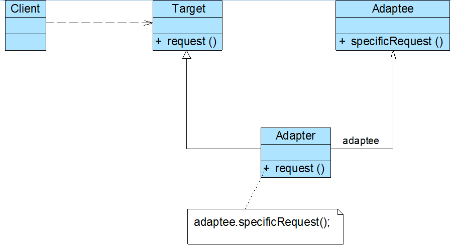

## 结构型模式 ##
> #### 适配器模式-Adapter Pattern ####
>>+ 对象适配器
>>+ 类适配器


-----
## 正文 ##
### 1. 适配器模式 ###

> 适配器模式可以将一个类的接口和另一个类的接口匹配起来，而无须修改原来的适配者接口和抽象目标类接口。适配器模式定义如下：
适配器模式(Adapter Pattern)：将一个接口转换成客户希望的另一个接口，使接口不兼容的那些类可以一起工作，其别名为包装器(Wrapper)。适配器模式既可以作为类结构型模式，也可以作为对象结构型模式。

#### 对象适配器 ####
**在对象适配器模式中，适配器与适配者之间是关联关系；在类适配器模式中，适配器与适配者之间是继承（或实现）关系**。在实际开发中，对象适配器的使用频率更高，对象适配器模式结构如图所示：


在对象适配器模式结构图中包含如下几个角色：
>+ Target（目标抽象类）：目标抽象类定义客户所需接口，可以是一个抽象类或接口，也可以是具体类。
>+ Adapter（适配器类）：适配器可以调用另一个接口，作为一个转换器，对Adaptee和Target进行适配，适配器类是适配器模式的核心，在对象适配器中，它通过继承Target并关联一个Adaptee对象使二者产生联系。
>+ Adaptee（适配者类）：适配者即被适配的角色，它定义了一个已经存在的接口，这个接口需要适配，适配者类一般是一个具体类，包含了客户希望使用的业务方法，在某些情况下可能没有适配者类的源代码。

#### 类适配器 ####
除了对象适配器模式之外，适配器模式还有一种形式，那就是类适配器模式，**类适配器模式和对象适配器模式最大的区别在于适配器和适配者之间的关系不同，对象适配器模式中适配器和适配者之间是关联关系，而类适配器模式中适配器和适配者是继承关系**，类适配器模式结构如图所示：


典型的类适配器代码如下所示：
````java
class Adapter extends Adaptee implements Target {  
    public void request() {  
        specificRequest();  
    }  
}  
````

适配器模式的主要优点：
>+ 将目标类和适配者类解耦，通过引入一个适配器类来重用现有的适配者类，无须修改原有结构。
>+ 增加了类的透明性和复用性，将具体的业务实现过程封装在适配者类中，对于客户端类而言是透明的，而且提高了适配者的复用性，同一个适配者类可以在多个不同的系统中复用。
>+ 灵活性和扩展性都非常好，通过使用配置文件，可以很方便地更换适配器，也可以在不修改原有代码的基础上增加新的适配器类，完全符合“开闭原则”。

类适配器模式的缺点如下：
>+ 对于Java、C#等不支持多重类继承的语言，一次最多只能适配一个适配者类，不能同时适配多个适配者；
>+ 适配者类不能为最终类，如在Java中不能为final类，C#中不能为sealed类；
>+ 在Java、C#等语言中，类适配器模式中的目标抽象类只能为接口，不能为类，其使用有一定的局限性。

对象适配器模式的缺点如下：
>+ 

适配器模式适用场景：
>+ 系统需要使用一些现有的类，而这些类的接口（如方法名）不符合系统的需要，甚至没有这些类的源代码。
>+ 想创建一个可以重复使用的类，用于与一些彼此之间没有太大关联的一些类，包括一些可能在将来引进的类一起工作。

-----
示例代码结构图：


示例代码：
> [adapterpatterndemo源代码][1]    

[1]: https://github.com/gregecho/JavaDesignPattern/tree/master/AdapterPattern/src/main

-----
### TODO
* [ ] 适配器模式在spring中的运用


