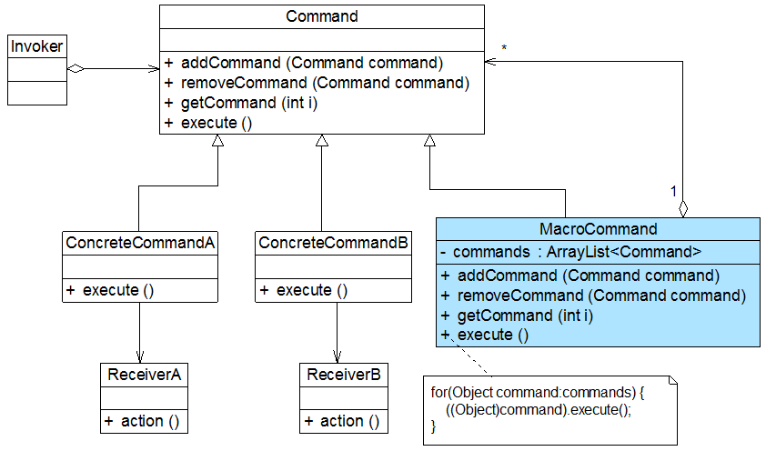

## 行为型模式 ##
> #### 命令模式-Command Pattern ####


-----
## 正文 ##
### 1. 命令模式 ###

命令模式可以将请求发送者和接收者完全解耦，发送者与接收者之间没有直接引用关系，发送请求的对象只需要知道如何发送请求，而不必知道如何完成请求。
命令模式定义如下：
> 命令模式(Command Pattern)：将一个请求封装为一个对象，从而让我们可用不同的请求对客户进行参数化；对请求排队或者记录请求日志，以及支持可撤销的操作。命令模式是一种对象行为型模式，其别名为动作(Action)模式或事务(Transaction)模式。


命令模式的核心在于引入了命令类，通过命令类来降低发送者和接收者的耦合度，请求发送者只需指定一个命令对象，再通过命令对象来调用请求接收者的处理方法，其结构如图所示：


在命令模式结构图中包含如下几个角色：
>+  Command（抽象命令类）：抽象命令类一般是一个抽象类或接口，在其中声明了用于执行请求的execute()等方法，通过这些方法可以调用请求接收者的相关操作。
>+ ConcreteCommand（具体命令类）：具体命令类是抽象命令类的子类，实现了在抽象命令类中声明的方法，它对应具体的接收者对象，将接收者对象的动作绑定其中。在实现execute()方法时，将调用接收者对象的相关操作(Action)。
>+  Invoker（调用者）：调用者即请求发送者，它通过命令对象来执行请求。一个调用者并不需要在设计时确定其接收者，因此它只与抽象命令类之间存在关联关系。在程序运行时可以将一个具体命令对象注入其中，再调用具体命令对象的execute()方法，从而实现间接调用请求接收者的相关操作。
>+ Receiver（接收者）：接收者执行与请求相关的操作，它具体实现对请求的业务处理。

**命令模式的本质是对请求进行封装，一个请求对应于一个命令，将发出命令的责任和执行命令的责任分割开**。每一个命令都是一个操作：请求的一方发出请求要求执行一个操作；接收的一方收到请求，并执行相应的操作。**命令模式允许请求的一方和接收的一方独立开来，使得请求的一方不必知道接收请求的一方的接口，更不必知道请求如何被接收、操作是否被执行、何时被执行，以及是怎么被执行的**。
**命令模式的关键在于引入了抽象命令类，请求发送者针对抽象命令类编程，只有实现了抽象命令类的具体命令才与请求接收者相关联**。

典型的抽象命令类代码如下所示：
````java
abstract class Command {  
    public abstract void execute();  
} 
````

对于请求发送者即调用者而言，将针对抽象命令类进行编程，可以通过构造注入或者设值注入的方式在运行时传入具体命令类对象，并在业务方法中调用命令对象的execute()方法，其典型代码如下所示：
````java
class Invoker {  
    private Command command;  
      
    //构造注入  
    public Invoker(Command command) {  
        this.command = command;  
    }  
      
    //设值注入  
    public void setCommand(Command command) {  
        this.command = command;  
    }  
      
    //业务方法，用于调用命令类的execute()方法  
    public void call() {  
        command.execute();  
    }  
}  
````

具体命令类继承了抽象命令类，它与请求接收者相关联，实现了在抽象命令类中声明的execute()方法，并在实现时调用接收者的请求响应方法action()，其典型代码如下所示：
````java
class ConcreteCommand extends Command {  
    private Receiver receiver; //维持一个对请求接收者对象的引用  
  
    public void execute() {  
        receiver.action(); //调用请求接收者的业务处理方法action()  
    }  
}  
````

请求接收者Receiver类具体实现对请求的业务处理，它提供了action()方法，用于执行与请求相关的操作，其典型代码如下所示：
````java
class Receiver {  
    public void action() {  
        //具体操作  
    }  
}
````

#### 宏命令 ####
**宏命令(Macro Command)又称为组合命令，它是组合模式和命令模式联用的产物**。宏命令是一个具体命令类，它**拥有一个集合属性，在该集合中包含了对其他命令对象的引用**。通常宏命令不直接与请求接收者交互，而是通过它的成员来调用接收者的方法。当调用宏命令的execute()方法时，将递归调用它所包含的每个成员命令的execute()方法，一个宏命令的成员可以是简单命令，还可以继续是宏命令。执行一个宏命令将触发多个具体命令的执行，从而实现对命令的批处理，其结构如图所示：



命令模式的主要优点：
>+ **降低系统的耦合度**。由于请求者与接收者之间不存在直接引用，因此请求者与接收者之间实现完全解耦，相同的请求者可以对应不同的接收者，同样，相同的接收者也可以供不同的请求者使用，两者之间具有良好的独立性。
>+ **新的命令可以很容易地加入到系统中**。由于增加新的具体命令类不会影响到其他类，因此增加新的具体命令类很容易，无须修改原有系统源代码，甚至客户类代码，满足“开闭原则”的要求。
>+ 可以比较容易地设计一个命令队列或宏命令（组合命令）。


命令模式的缺点如下：
>+ 使用命令模式可能会导致某些系统有过多的具体命令类。因为针对每一个对请求接收者的调用操作都需要设计一个具体命令类，因此在某些系统中可能需要提供大量的具体命令类，这将影响命令模式的使用。


命令模式适用场景：
>+ 系统需要将请求调用者和请求接收者解耦，使得调用者和接收者不直接交互。请求调用者无须知道接收者的存在，也无须知道接收者是谁，接收者也无须关心何时被调用。
>+ 系统需要在不同的时间指定请求、将请求排队和执行请求。一个命令对象和请求的初始调用者可以有不同的生命期，换言之，最初的请求发出者可能已经不在了，而命令对象本身仍然是活动的，可以通过该命令对象去调用请求接收者，而无须关心请求调用者的存在性，可以通过请求日志文件等机制来具体实现。
>+ 在一个系统中能够分离出叶子对象和容器对象，而且它们的类型不固定，需要增加一些新的类型。
>+ 系统需要支持命令的撤销(Undo)操作和恢复(Redo)操作。

-----
示例代码结构图：


示例代码：
> [CommandPatternDemo源代码][1]    

[1]: https://github.com/gregecho/JavaDesignPattern/tree/master/CommandPattern/src/main


-----
### TODO
* [ ] 命令模式在spring中的运用


