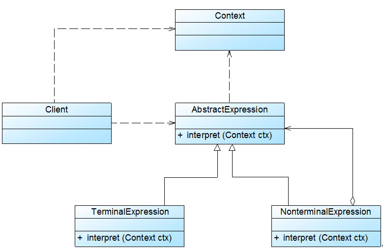

## 行为型模式 ##
> #### 解释器模式-Interpreter Pattern ####

-----
## 正文 ##
### 1. 解释器模式 ###

解释器模式定义如下：
> 解释器模式(Interpreter Pattern)：定义一个语言的文法，并且建立一个解释器来解释该语言中的句子，这里的“语言”是指使用规定格式和语法的代码。解释器模式是一种类行为型模式。

由于表达式可分为终结符表达式和非终结符表达式，因此解释器模式的结构与[组合模式](https://github.com/gregecho/JavaDesignPattern/blob/master/Document/Design_Pattern_Part3_Structural_Pattern_Composite_Pattern.md)的结构有些类似，但在解释器模式中包含更多的组成元素，它的结构如图所示：


在解释器模式结构图中包含如下几个角色：
>+ AbstractExpression（抽象表达式）：在抽象表达式中声明了抽象的解释操作，它是所有终结符表达式和非终结符表达式的公共父类。
>+ TerminalExpression（终结符表达式）：终结符表达式是抽象表达式的子类，它实现了与文法中的终结符相关联的解释操作，在句子中的每一个终结符都是该类的一个实例。通常在一个解释器模式中只有少数几个终结符表达式类，它们的实例可以通过非终结符表达式组成较为复杂的句子。
>+ NonterminalExpression（非终结符表达式）：非终结符表达式也是抽象表达式的子类，它实现了文法中非终结符的解释操作，由于在非终结符表达式中可以包含终结符表达式，也可以继续包含非终结符表达式，因此其解释操作一般通过递归的方式来完成。
>+ Context（环境类）：环境类又称为上下文类，它用于存储解释器之外的一些全局信息，通常它临时存储了需要解释的语句。

在解释器模式中，每一种终结符和非终结符都有一个具体类与之对应，正因为使用类来表示每一条文法规则，所以系统将具有较好的灵活性和可扩展性。对于所有的终结符和非终结符，我们首先需要抽象出一个公共父类，即抽象表达式类，其典型代码如下所示：
````java

abstract class AbstractExpression {
       public  abstract void interpret(Context ctx);
}
````
终结符表达式和非终结符表达式类都是抽象表达式类的子类，对于终结符表达式，其代码很简单，主要是对终结符元素的处理，其典型代码如下所示:
````java

class TerminalExpression extends  AbstractExpression {
       public  void interpret(Context ctx) {
              //终结符表达式的解释操作
       }
}
````
对于非终结符表达式，其代码相对比较复杂，因为可以通过非终结符将表达式组合成更加复杂的结构，对于包含两个操作元素的非终结符表达式类，其典型代码如下：
````java

class NonterminalExpression extends  AbstractExpression {
       private  AbstractExpression left;
       private  AbstractExpression right;
      
       public  NonterminalExpression(AbstractExpression left,AbstractExpression right) {
              this.left=left;
              this.right=right;
       }
      
       public void interpret(Context ctx) {
              //递归调用每一个组成部分的interpret()方法
              //在递归调用时指定组成部分的连接方式，即非终结符的功能
       }     
}
````

除了上述用于表示表达式的类以外，通常在解释器模式中还提供了一个环境类Context，用于存储一些全局信息，通常在Context中包含了一个HashMap或ArrayList等类型的集合对象（也可以直接由HashMap等集合类充当环境类），存储一系列公共信息，如变量名与值的映射关系（key/value）等，用于在进行具体的解释操作时从中获取相关信息。其典型代码片段如下：
````java

class Context {
     private HashMap map = new HashMap();
     public void assign(String key, String value) {
         //往环境类中设值
     }
public String  lookup(String key) {
         //获取存储在环境类中的值
     }
}
````

示例代码结构图：


**AbstractNode充当抽象表达式角色，DirectionNode、ActionNode和DistanceNode充当终结符表达式角色，AndNode和SentenceNode充当非终结符表达式角色。**

示例代码：
> [InterpreterPatternDemo][1]    

[1]: https://github.com/gregecho/JavaDesignPattern/tree/master/InterpreterPattern/src/main


解释器模式的主要优点如下：
>+ 易于改变和扩展文法。由于在解释器模式中使用类来表示语言的文法规则，因此可以通过继承等机制来改变或扩展文法。
>+ 每一条文法规则都可以表示为一个类，因此可以方便地实现一个简单的语言。
>+ 实现文法较为容易。在抽象语法树中每一个表达式节点类的实现方式都是相似的，这些类的代码编写都不会特别复杂，还可以通过一些工具自动生成节点类代码。
>+ 增加新的解释表达式较为方便。如果用户需要增加新的解释表达式只需要对应增加一个新的终结符表达式或非终结符表达式类，原有表达式类代码无须修改，符合“开闭原则”。


解释器模式的缺点如下：
>+对于复杂文法难以维护。在解释器模式中，每一条规则至少需要定义一个类，因此如果一个语言包含太多文法规则，类的个数将会急剧增加，导致系统难以管理和维护，此时可以考虑使用语法分析程序等方式来取代解释器模式。
>+ 执行效率较低。由于在解释器模式中使用了大量的循环和递归调用，因此在解释较为复杂的句子时其速度很慢，而且代码的调试过程也比较麻烦。

解释器模式适用场景：
>+ 可以将一个需要解释执行的语言中的句子表示为一个抽象语法树。
>+ 一些重复出现的问题可以用一种简单的语言来进行表达。
>+ 一个语言的文法较为简单。
>+ 执行效率不是关键问题。【注：高效的解释器通常不是通过直接解释抽象语法树来实现的，而是需要将它们转换成其他形式，使用解释器模式的执行效率并不高。

-----
### TODO
* [ ] 解释器模式在Spring中的运用


