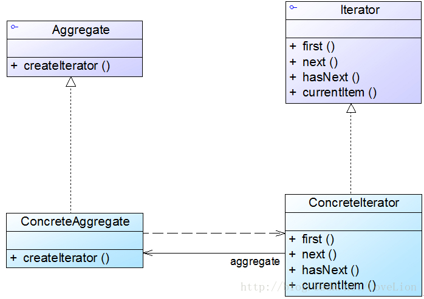

## 行为型模式 ##
> #### 迭代器模式-Iterator Pattern ####

-----
## 正文 ##
### 1. 迭代器模式 ###

迭代器模式定义如下：
迭代器模式(Iterator Pattern)：提供一种方法来访问聚合对象，而不用暴露这个对象的内部表示，其别名为游标(Cursor)。迭代器模式是一种对象行为型模式。

在迭代器模式结构中包含**聚合**和**迭代器**两个层次结构，考虑到系统的灵活性和可扩展性，在**迭代器模式中应用了工厂方法模式**，其模式结构如图3所示：

在迭代器模式结构图中包含如下几个角色：
>+  Iterator（抽象迭代器）：它定义了访问和遍历元素的接口，声明了用于遍历数据元素的方法，例如：用于获取第一个元素的first()方法，用于访问下一个元素的next()方法，用于判断是否还有下一个元素的hasNext()方法，用于获取当前元素的currentItem()方法等，在具体迭代器中将实现这些方法。
>+ ConcreteIterator（具体迭代器）：它实现了抽象迭代器接口，完成对聚合对象的遍历，同时在具体迭代器中通过游标来记录在聚合对象中所处的当前位置，在具体实现时，游标通常是一个表示位置的非负整数。
>+  Aggregate（抽象聚合类）：它用于存储和管理元素对象，声明一个createIterator()方法用于创建一个迭代器对象，充当抽象迭代器工厂角色。
>+ ConcreteAggregate（具体聚合类）：它实现了在抽象聚合类中声明的createIterator()方法，该方法返回一个与该具体聚合类对应的具体迭代器ConcreteIterator实例。

在**迭代器模式中应用了工厂方法模式**，**抽象迭代器对应于抽象产品角色，具体迭代器对应于具体产品角色，抽象聚合类对应于抽象工厂角色，具体聚合类对应于具体工厂角色**。

迭代器模式的主要优点：
>+  它支持以不同的方式遍历一个聚合对象，在同一个聚合对象上可以定义多种遍历方式。在迭代器模式中只需要用一个不同的迭代器来替换原有迭代器即可改变遍历算法，我们也可以自己定义迭代器的子类以支持新的遍历方式。
>+ 迭代器简化了聚合类。由于引入了迭代器，在原有的聚合对象中不需要再自行提供数据遍历等方法，这样可以简化聚合类的设计。
>+ 在迭代器模式中，由于引入了抽象层，增加新的聚合类和迭代器类都很方便，无须修改原有代码，满足“开闭原则”的要求。

迭代器模式的缺点如下：
>+ 由于迭代器模式将存储数据和遍历数据的职责分离，增加新的聚合类需要对应增加新的迭代器类，类的个数成对增加，这在一定程度上增加了系统的复杂性。

迭代器模式适用场景：
>+ 访问一个聚合对象的内容而无须暴露它的内部表示。将聚合对象的访问与内部数据的存储分离，使得访问聚合对象时无须了解其内部实现细节。
>+ 需要为一个聚合对象提供多种遍历方式。
>+ 为遍历不同的聚合结构提供一个统一的接口，在该接口的实现类中为不同的聚合结构提供不同的遍历方式，而客户端可以一致性地操作该接口。

-----
示例代码结构图：

示例代码：
> [IteratorPatternDemo源代码][1]    

[1]: https://github.com/gregecho/JavaDesignPattern/tree/master/IteratorPattern/src/main

-----
### TODO
* [ ] 迭代器模式在Java JDK中的运用

