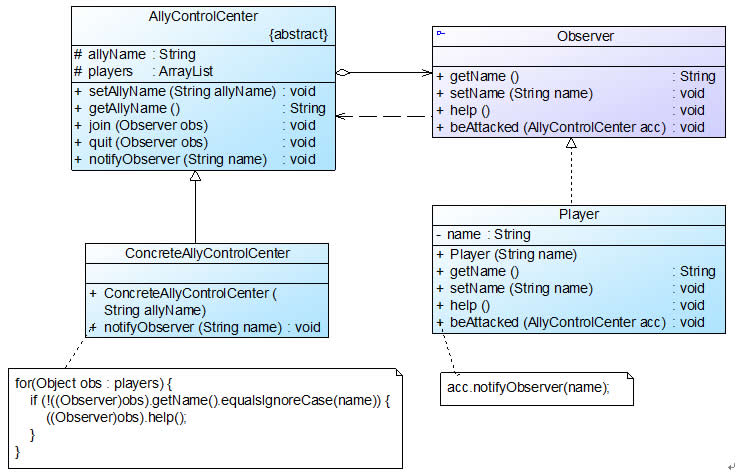

## 行为型模式 ##
> #### 观察者模式-Observer Pattern ####


-----
## 正文 ##
### 1. 观察者模式 ###

观察者模式是使用频率最高的设计模式之一，它用于建立一种对象与对象之间的依赖关系，一个对象发生改变时将自动通知其他对象，其他对象将相应作出反应。在观察者模式中，发生改变的对象称为观察目标，而被通知的对象称为观察者，一个观察目标可以对应多个观察者，而且这些观察者之间可以没有任何相互联系，可以根据需要增加和删除观察者，使得系统更易于扩展。
观察者模式定义如下：
> 观察者模式(Observer Pattern)：定义对象之间的一种一对多依赖关系，使得每当一个对象状态发生改变时，其相关依赖对象皆得到通知并被自动更新。观察者模式的别名包括发布-订阅（Publish/Subscribe）模式、模型-视图（Model/View）模式、源-监听器（Source/Listener）模式或从属者（Dependents）模式。观察者模式是一种对象行为型模式。

 观察者模式结构中通常包括观察目标和观察者两个继承层次结构，其结构如图所示：


在观察者模式结构图中包含如下几个角色：
>+  Subject（目标）：目标又称为主题，它是指被观察的对象。在目标中定义了一个观察者集合，一个观察目标可以接受任意数量的观察者来观察，它提供一系列方法来增加和删除观察者对象，同时它定义了通知方法notify()。目标类可以是接口，也可以是抽象类或具体类。
>+  ConcreteSubject（具体目标）：具体目标是目标类的子类，通常它包含有经常发生改变的数据，当它的状态发生改变时，向它的各个观察者发出通知；同时它还实现了在目标类中定义的抽象业务逻辑方法（如果有的话）。如果无须扩展目标类，则具体目标类可以省略。
>+  Observer（观察者）：观察者将对观察目标的改变做出反应，观察者一般定义为接口，该接口声明了更新数据的方法update()，因此又称为抽象观察者。
>+ ConcreteObserver（具体观察者）：在具体观察者中维护一个指向具体目标对象的引用，它存储具体观察者的有关状态，这些状态需要和具体目标的状态保持一致；它实现了在抽象观察者Observer中定义的update()方法。通常在实现时，可以调用具体目标类的attach()方法将自己添加到目标类的集合中或通过detach()方法将自己从目标类的集合中删除


下面通过示意代码来对该模式进行进一步分析。首先我们定义一个抽象目标Subject，典型代码如下所示
````java
import java.util.*;  
abstract class Subject {  
    //定义一个观察者集合用于存储所有观察者对象  
    protected ArrayList observers<Observer> = new ArrayList();  
    
    //注册方法，用于向观察者集合中增加一个观察者  
    public void attach(Observer observer) {  
        observers.add(observer);  
    }  
    
    //注销方法，用于在观察者集合中删除一个观察者  
    public void detach(Observer observer) {  
        observers.remove(observer);  
    }  
    
    //声明抽象通知方法  
    public abstract void notify();  
}  
````

具体目标类ConcreteSubject是实现了抽象目标类Subject的一个具体子类，其典型代码如下所示：
````java
class ConcreteSubject extends Subject {  
    //实现通知方法  
    public void notify() {  
        //遍历观察者集合，调用每一个观察者的响应方法  
        for(Object obs:observers) {  
            ((Observer)obs).update();  
        }  
    }     
}  
````

抽象观察者角色一般定义为一个接口，通常只声明一个update()方法，为不同观察者的更新（响应）行为定义相同的接口，这个方法在其子类中实现，不同的观察者具有不同的响应方法。抽象观察者Observer典型代码如下所示：
````java
interface Observer {  
    //声明响应方法  
    public void update();  
}  
````

在具体观察者ConcreteObserver中实现了update()方法，其典型代码如下所示：
````java
class ConcreteObserver implements Observer {  
    //实现响应方法  
    public void update() {  
        //具体响应代码  
    }  
} 
````

#### JDK对观察者模式的支持 ####
观察者模式在Java语言中的地位非常重要。在JDK的java.util包中，提供了Observable类以及Observer接口，它们构成了JDK对观察者模式的支持。如图所示：


> 1. **Observer接口**在java.util.Observer接口中只声明一个方法，它充当抽象观察者，其方法声明代码如下所示：void  update(Observable o, Object arg);
当观察目标的状态发生变化时，该方法将会被调用，在Observer的子类中将实现update()方法，即具体观察者可以根据需要具有不同的更新行为。当调用观察目标类Observable的notifyObservers()方法时，将执行观察者类中的update()方法。
> 2. **Observable类**java.util.Observable类充当观察目标类，在Observable中定义了一个向量Vector来存储观察者对象。


观察者模式的主要优点如下：
>+ 观察者模式可以实现表示层和数据逻辑层的分离，定义了稳定的消息更新传递机制，并抽象了更新接口，使得可以有各种各样不同的表示层充当具体观察者角色。
>+ 观察者模式在观察目标和观察者之间建立一个抽象的耦合。观察目标只需要维持一个抽象观察者的集合，无须了解其具体观察者。由于观察目标和观察者没有紧密地耦合在一起，因此它们可以属于不同的抽象化层次。
>+  观察者模式支持广播通信，观察目标会向所有已注册的观察者对象发送通知，简化了一对多系统设计的难度。
>+  观察者模式满足“开闭原则”的要求，增加新的具体观察者无须修改原有系统代码，在具体观察者与观察目标之间不存在关联关系的情况下，增加新的观察目标也很方便。


观察者模式的缺点如下：
>+ 如果一个观察目标对象有很多直接和间接观察者，将所有的观察者都通知到会花费很多时间。

观察者模式适用场景：
>+ 一个抽象模型有两个方面，其中一个方面依赖于另一个方面，将这两个方面封装在独立的对象中使它们可以各自独立地改变和复用。
>+  一个对象的改变将导致一个或多个其他对象也发生改变，而并不知道具体有多少对象将发生改变，也不知道这些对象是谁。
>+ 需要在系统中创建一个触发链，A对象的行为将影响B对象，B对象的行为将影响C对象……，可以使用观察者模式创建一种链式触发机制。

-----
示例代码结构图：


示例代码：
> [ObserverPatternDemo源代码][1]    

[1]: https://github.com/gregecho/JavaDesignPattern/tree/master/ObserverPattern/src/main


-----
### TODO
* [ ] 观察者模式在java中的运用


